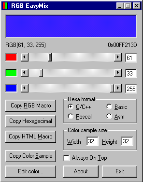

# RGB EasyMix

**Released in 1997. Written in Visual Basic 4.0 and Borland Delphi 3, on Windows 95.**

RGB EasyMix is a small and easy-to-use, yet powerful RGB color editor. With RGB EasyMix you can easily make-up a RGB color by editing the amount of red, green and blue. You can copy the resulting RGB color to the clipboard in many different formats. The yellow color can be copied as:

- a RGB macro: `RGB(255, 255, 0)`
- a C/C++ hexadecimal number: `0x0000FFFF`
- a Pascal/Delphi hexadecimal number: `$0000FFFF`
- a Basic/Visual Basic hexadecimal number: `&H0000FFFF&`
- an Assembly Language hexadecimal number: `0000FFFFH`
- a HTML macro: `#00FFFF`
- a color sample (a bitmap from 8x8 pixels to 256x256 pixels).

You can also define custom colors that can be saved for future use.

## Screenshot

## Source Code

RGB EasyMix was written in Visual Basic 4.0. The Custom Color DLL was written in Borland Delphi 3.

## Installation Instructions

How to install RGB EasyMix? Simply copy the following files to a directory of your choice:

- `rgbeasy.exe` the application file
- `custcol.dll`	additional DLL
- `rgbeasy.ini` configuration file
- `readme.txt`  Readme file (this file)
- `license.txt` License file
- `file_id.diz` short description of this software

To run RGB EasyMix, double click on the file called `rgbeasy.exe`.

To create a shortcut to this file in your Start->Programs Menu:

1. Launch Explorer and find the file `rgbeasy.exe`.
2. Right click on the Windows 95 Start Button and select Open.
3. Double Click on Programs.
4. With the right mouse button, drag the rgbeasy.exe file into the Programs window, and select Create Shortcut Here. You may rename the shortcut to `RGB EasyMix` if you wish.
5. You may now launch RGB EasyMix by clicking Start>Programs>RGB EasyMix.

**Note:** This program requires that the Visual Basic 4.0 Windows runtime files are installed on your computer. If you do not have them, you should be able to  get them from the same place you found this program. Many software products need these files, and you only need to download them once.

## Contributions

All contributions are welcome: use-cases, documentation, design, graphics, icons, code, patches, bug reports, feature requests, suggestions, etc. You do not need to be a programmer to speak up! Also, if you like RGB EasyMix, give it a star on GitHub! ⭐️

## Contact information

Web: https://www.appliberated.com

E-mail:	contact@appliberated.com

We will gladly answer any questions and help you with RGB EasyMix problems.

Any suggestions, comments and bug reports are welcome and encouraged!

## License

RGB EasyMix is licensed under the [MIT License](LICENSE).
